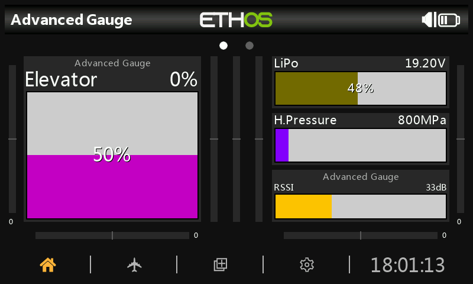
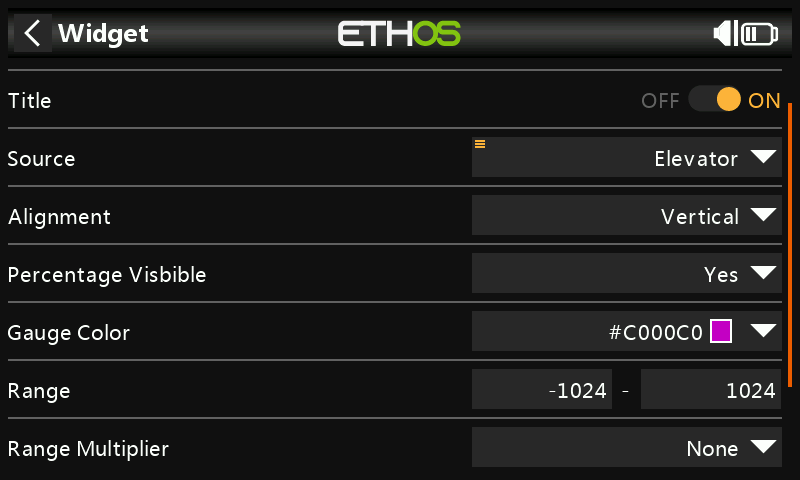
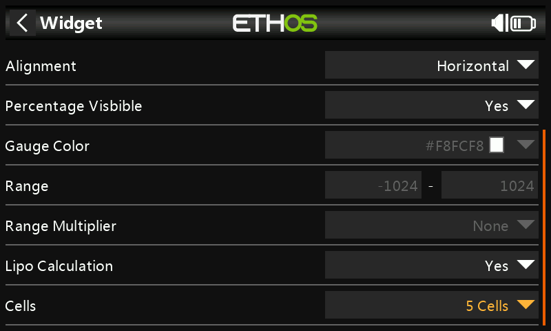

# AdvGauge

 ETHOS - Advanced Gauge Widget

------

Advanced Gauge is a next level gauge compared to the standard ETHOS gauge widget.

The gauge is more flexible:

## Features are:

- Gauge can be Horizontal or Vertical

- Source input in range mode can be multiplied or divided.
  For example, if you have a source that has values exceeding more then 1024.
  You can divide it in factors 10 and 100.

- Lipo to Percentage calculation.

  - When activated, Range mode is disabled.
  - Take any (Lipo) Voltage Source, enter the amount of cells used, And the gauge acts like a Lipo checker.
  - Note, do not use this function for accurate measurements, it just gives you an some sort of aproximate readout.

  

  ## Installation

  Copy **advgauge.lua** to you ETHOS SD Card, in the **SCRIPTS** folder

  

  **Revisions:**

  v1.07
  
  - Scripts File/Folder structure changed. Only compatible with v1.1.0 Alpha 14 or later.
  
  v1.06

  - Now possible to set enable/disable Gradient independent from Lipo selection
  - Gradient Inversion
  - RED level threshold enable/disable

  v1.05

  - Storage and color definitions fixed for v1.1.0 Alpha 10 and later

  

  

